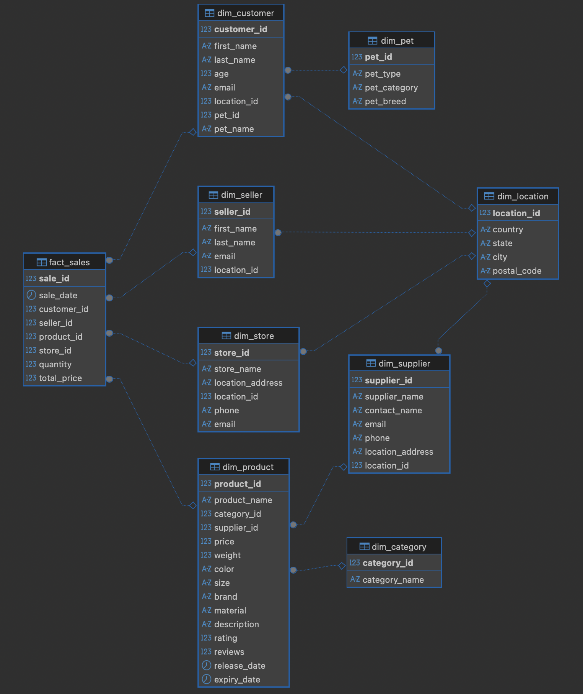

# BigDataSnowflake
Анализ больших данных - лабораторная работа №1 - нормализация данных в снежинку

Одна из задач data engineer при работе с данными BigData трансформировать исходную модель данных источника в аналитическую модель данных. Аналитическая модель данных позволяет исследовать данные и принимать на основе полученных данных решения. Классическими универсальными схемами для анализа данных являются "звезда" и "снежинка". В лабораторной работе вам предстоит потренироваться в трансформации исходных данных из источников в модель данных снежинка.

Что необходимо сделать?

Необходимо данные источника (файлы mock_data.csv с номерами), которые представляют информацию о покупателях, продавцах, поставщиках, магазинах, товарах для домашних питомцев трансформировать в модель снежинка/звезда (факты и измерения с нормализацией).


## Структура проекта
```text
.
├── README.md
├── docker-compose.yml
├── migrations                  # SQL-скрипты автоматической миграции
│   ├── 01_init_raw.sql         # DDL: создание сырой таблицы
│   ├── 02_load_raw.sql         # DML: загрузка CSV
│   ├── 03_ddl_snowflake.sql    # DDL: создание измерений и фактов
│   └── 04_dml_snowflake.sql    # DML: нормализация и заполнение модели
├── raw_data                    # Исходные данные
│   ├── MOCK_DATA (1).csv
│   ├── ...
│   └── MOCK_DATA.csv
└── uml.png                     # Логическая схема БД
```

## UML Схема (Модель "Снежинка")


## Инструкция по запуску
Развертывание БД, выполнение DDL-скриптов и переливка данных (DML) полностью автоматизированы через механизм `docker-entrypoint-initdb.d`.

1. Запустить контейнер:
```bash
docker compose up -d --build
```
2. Дождаться окончания выполнения миграций (около 10-15 секунд). Проверить статус можно в логах:
```bash
docker logs -f petshop
```

## Проверка и аналитические SQL-запросы

Параметры подключения к БД:
* **Host:** `localhost:5432`
* **DB:** `petshop`
* **User:** `postgres` / **Password:** `postgres`

### 1. Проверка целостности загрузки
Количество строк в таблице фактов должно совпадать с исходным объемом сырых данных (10 000).
```sql
SELECT count(*) AS total_sales FROM fact_sales;
```

### 2. Аналитический запрос (Пример использования модели)
*Вывод Топ-5 стран по выручке в категории товаров "Dogs" с указанием поставщика:*
```sql
SELECT 
    loc.country AS customer_country,
    sup.supplier_name,
    SUM(f.quantity) as total_items_sold,
    SUM(f.total_price) as total_revenue
FROM fact_sales f
JOIN dim_customer c ON f.customer_id = c.customer_id
JOIN dim_location loc ON c.location_id = loc.location_id
JOIN dim_pet pet ON c.pet_id = pet.pet_id
JOIN dim_product p ON f.product_id = p.product_id
JOIN dim_supplier sup ON p.supplier_id = sup.supplier_id
WHERE pet.pet_category = 'Dogs' AND loc.country IS NOT NULL
GROUP BY loc.country, sup.supplier_name
ORDER BY total_revenue DESC
LIMIT 5;
```

### 3. Сводка по категориям товаров
*Выручка и количество проданных единиц в разрезе категорий:*
```sql
SELECT 
    c.category_name,
    SUM(f.total_price) AS total_revenue,
    SUM(f.quantity) AS items_sold
FROM fact_sales f
JOIN dim_product p ON f.product_id = p.product_id
JOIN dim_category c ON p.category_id = c.category_id
GROUP BY c.category_name
ORDER BY total_revenue DESC;
```
